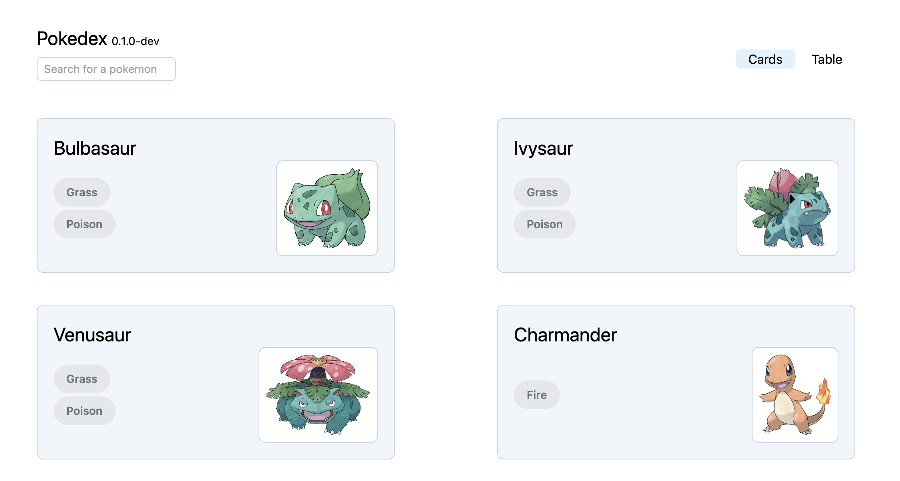
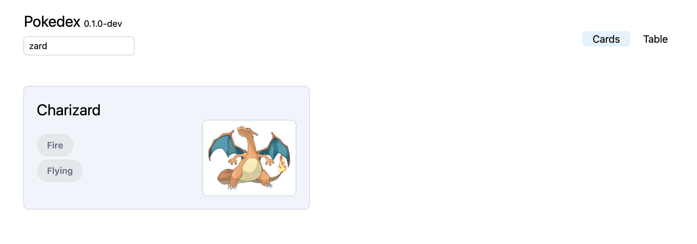
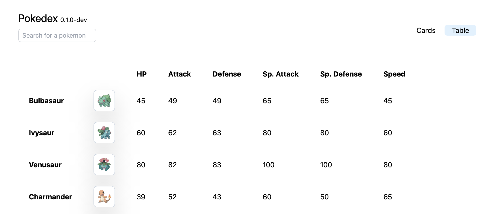
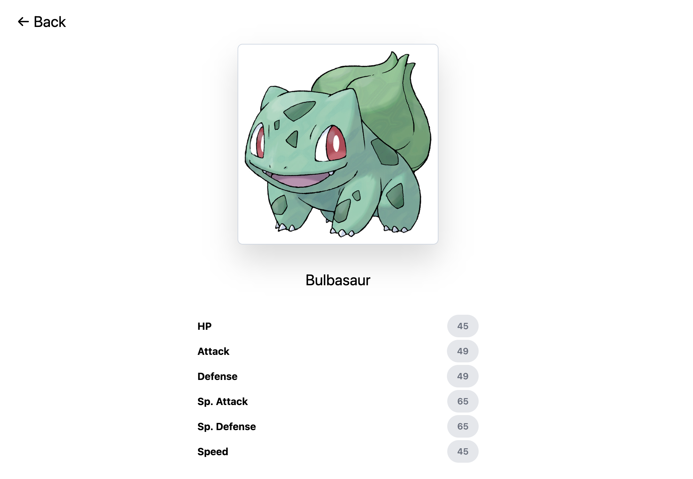

# Broken Next.js application v1

## Problem Statement

You have received git repository with a broken Next.js application written in TypeScript. The App is displaying list of Pokémons using a simple REST API.

## Target of this assessment

- fix the application features as described bellow
- all scripts defined in `package.json` must be passing
- development and production versions of the application are working

### Application features

On the main page, there is a list of Pokémons. User can switch between `cards` and `table` view.



The list of Pokémons can be filtered by search in the top left corner, allowing users to search Pokémons by their name.



_Table view with sorting is missing_, you need to implement it, using the existing REST API to match the attached design.

Users can sort stats columns in the table by clicking on the header of the respected column. Columns can be sorted ascending, descending using backend sorting on REST API.



By clicking on Pokémon's name, the users can visit the detail page showing Pokémon's stats.



## Deliverable

Github repository with a functional application, with all `package.json` scripts passing and development and production versions working.

## Make sure

- all application features are working
- all scripts defined in `package.json` must be passing
- development and production versions of the application are working
- clean, concise and readable code

## Evaluation Criteria

1. Deliverables
2. Following best FE practices & idioms
3. UI design best practices, good user experience
4. Simplicity of implementation combined with the extensibility of design
5. Any improvements you can think of

## Repository info

This is a [Next.js](https://nextjs.org/) project bootstrapped with [`create-next-app`](https://github.com/vercel/next.js/tree/canary/packages/create-next-app).

## Getting Started

First, run the development server:

```bash
npm run dev
# or
yarn dev
```

Open [http://localhost:3000](http://localhost:3000) with your browser to see the result.

You can start editing the page by modifying `pages/index.tsx`. The page auto-updates as you edit the file.

[API routes](https://nextjs.org/docs/api-routes/introduction) can be accessed on [http://localhost:3000/api/hello](http://localhost:3000/api/hello). This endpoint can be edited in `pages/api/hello.ts`.

The `pages/api` directory is mapped to `/api/*`. Files in this directory are treated as [API routes](https://nextjs.org/docs/api-routes/introduction) instead of React pages.

## Learn More

To learn more about Next.js, take a look at the following resources:

- [Next.js Documentation](https://nextjs.org/docs) - learn about Next.js features and API.
- [Learn Next.js](https://nextjs.org/learn) - an interactive Next.js tutorial.

You can check out [the Next.js GitHub repository](https://github.com/vercel/next.js/) - your feedback and contributions are welcome!
